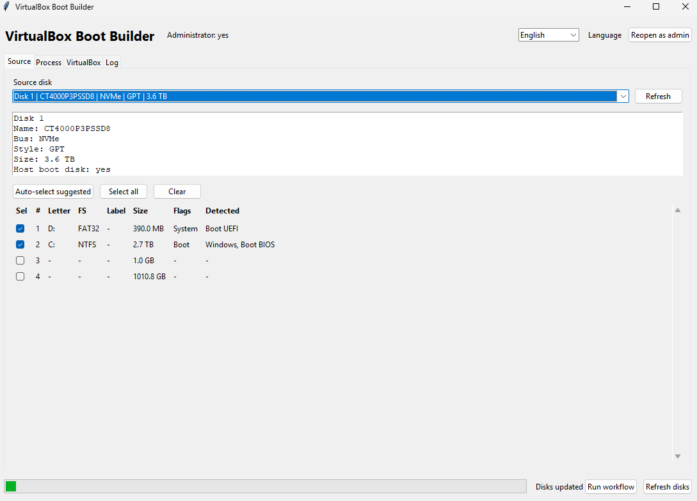

# HDD to VirtualBox HDD

HDD to VirtualBox HDD es una utilidad GUI para Windows para convertir una instalacion existente de Windows en un disco fisico, USB o externo en una imagen arrancable dentro de VirtualBox.

Fue creada para emular dentro de VirtualBox un disco duro externo con Windows 7 y software precargado, de forma que se puedan hacer pruebas de entornos legados sin modificar el disco original.

La aplicacion de escritorio incluida en este repositorio se llama `VirtualBox Boot Builder`. Automatiza un flujo que normalmente obliga a hacer varios pasos manuales:



Pantalla principal de la app seleccionando un disco origen y las particiones sugeridas antes de crear una imagen arrancable en VirtualBox.

- inspeccionar discos y particiones
- elegir la particion de arranque y la particion de Windows
- crear un `VHD` o `VHDX` con Sysinternals `Disk2vhd`
- reparar los archivos de arranque offline
- activar drivers de almacenamiento offline para reducir `STOP 0x7B`
- opcionalmente crear o actualizar una VM de VirtualBox y adjuntar la imagen

Eso hace que el proyecto sea especialmente util para pruebas con Windows 7, validacion de software legado, virtualizacion de discos externos, migracion de discos USB y ensayos de sistemas antiguos que dependen de un entorno ya configurado.

## Casos de uso comunes

- Emular en VirtualBox un disco externo con Windows 7
- Arrancar un disco USB de Windows con software preinstalado para pruebas
- Conservar un entorno legado de Windows 7 antes de una migracion
- Validar software antiguo de empresa, laboratorio, industria o servicio dentro de una VM
- Convertir un disco fisico de Windows en un VHD o VHDX legible por VirtualBox

## Funciones principales

- Deteccion de discos y particiones desde una GUI
- Seleccion separada de carpeta de salida y nombre del archivo
- Seleccion sugerida de particiones para esquemas BIOS y UEFI comunes
- Presets para Windows 7 legado, instalaciones BIOS genericas e instalaciones UEFI genericas
- Parametros configurables de firmware, controlador, chipset, memoria, CPUs y tipo de SO invitado de VirtualBox
- Log de ejecucion en tiempo real
- Elevacion automatica a administrador por defecto
- Interfaz en ingles por defecto con opcion para cambiar a espanol

## Requisitos

- Windows
- Permisos de administrador
- Python 3.13+ si ejecutas la version `.py`
- VirtualBox instalado si quieres que la app configure una VM automaticamente
- Acceso a Internet en la primera creacion de imagen si `Disk2vhd` todavia no se ha descargado

## Como abrirla

Ejecutable portable:

- `portable/VirtualBoxBootBuilder/VirtualBoxBootBuilder.exe`

Version fuente:

- `run-virtualbox-boot-builder.cmd`
- o `python vbox_boot_builder\virtualbox_boot_builder.py`

La app pide elevacion automaticamente. El `.exe` empaquetado tambien se construye con manifiesto de administrador.

## Flujo tipico

1. Abre la app como administrador.
2. Selecciona el disco origen.
3. Manten las particiones sugeridas de arranque y Windows, o ajustalas manualmente.
4. Elige la carpeta de salida y el nombre del archivo `VHD` o `VHDX`. Por defecto, la app usa la carpeta donde esta el `.exe`.
5. Manten activada la reparacion salvo que quieras solo captura en bruto.
6. En la pestana VirtualBox, elige el tipo de SO invitado y la configuracion de la VM.
7. Ejecuta el flujo.

## Notas

- Las instalaciones Windows BIOS antiguas suelen necesitar tanto la particion pequena de arranque como la particion principal de Windows.
- No guardes la imagen generada en el mismo disco fisico que intentas capturar. La app valida esto antes de empezar.
- Si un Windows copiado sigue cayendo con `0x7B`, la app intenta aplicar un parche offline de drivers de almacenamiento y limpiar `MountedDevices`.
- Para Windows antiguos, `IDE` suele ser mas compatible que `SATA`.
- Algunos sistemas pueden seguir necesitando Reparacion de inicio desde una ISO de Windows o `sysprep /generalize` en la maquina original.

## Estructura del proyecto

- `vbox_boot_builder/virtualbox_boot_builder.py`: app principal GUI
- `vbox_boot_builder/backend/list-disks.ps1`: inventario de discos
- `vbox_boot_builder/backend/create-vhd.ps1`: creacion de imagen
- `vbox_boot_builder/backend/repair-vhd.ps1`: reparacion de arranque y parcheo de drivers
- `vbox_boot_builder/backend/configure-vbox-vm.ps1`: preparacion de VM de VirtualBox
- `build-virtualbox-boot-builder-exe.ps1`: script de build con PyInstaller

## Build del EXE

```powershell
powershell -NoProfile -ExecutionPolicy Bypass -File .\build-virtualbox-boot-builder-exe.ps1
```

El script genera el ejecutable de Windows en `portable/VirtualBoxBootBuilder/`.
